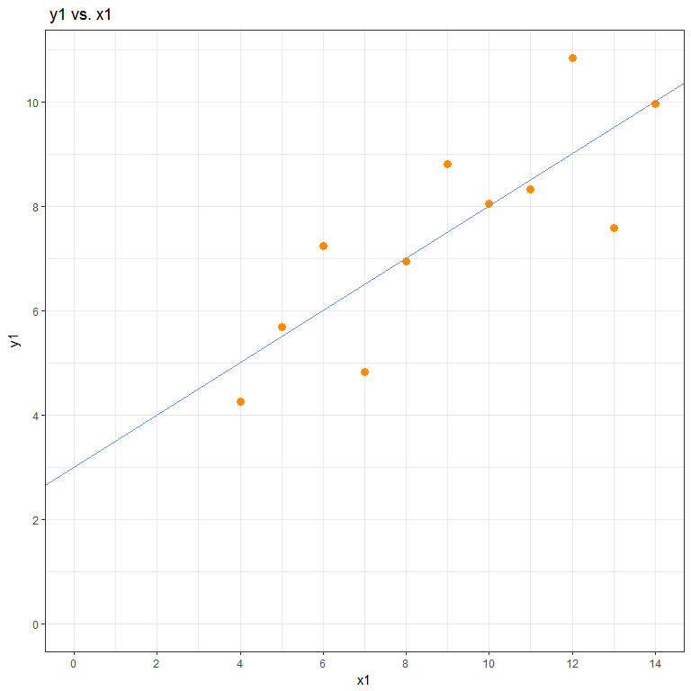
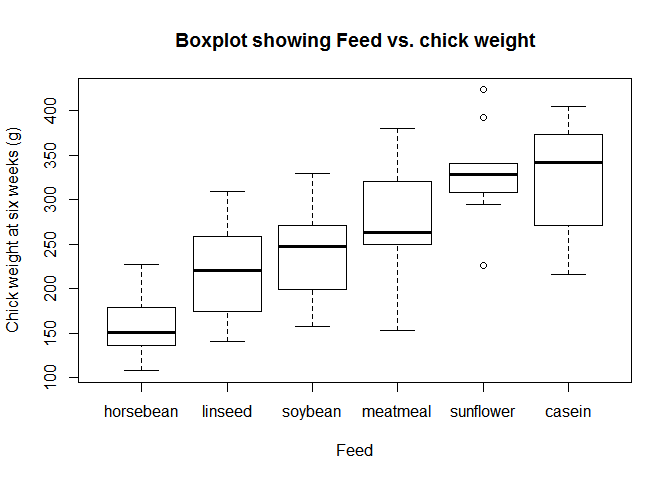
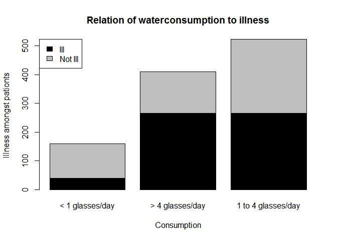
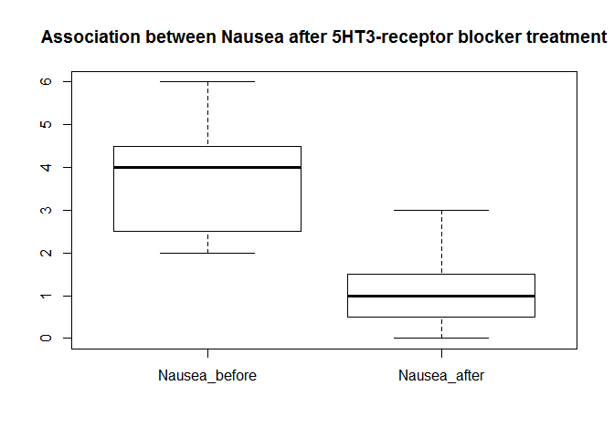
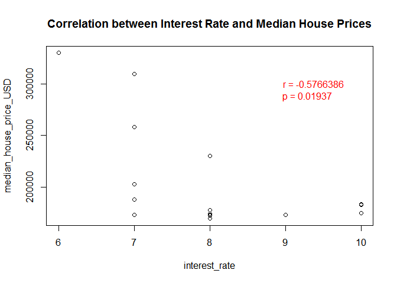
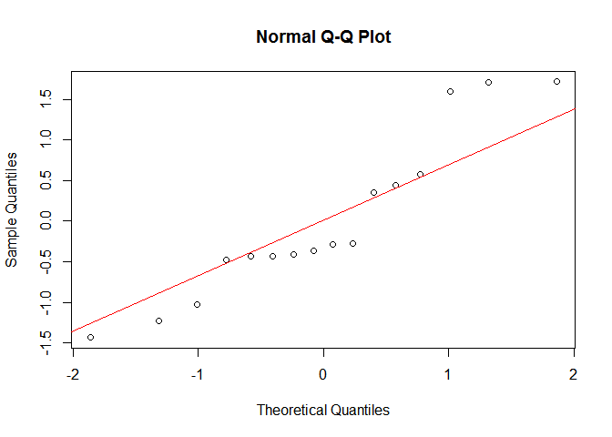
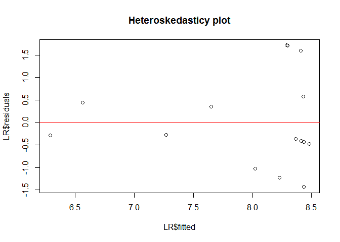

##### Author: Daniel Fernandes

##### Student number: 722797

<H2>
Hello Octocat
</H2>

##### I love Octocat. She is the coolest cat in town!

### Dimensions of data frame for anscombe.

### 

Assignment 2
============

    #1-Dimension names

    data(anscombe)
    dimnames(anscombe)

    ## [[1]]
    ##  [1] "1"  "2"  "3"  "4"  "5"  "6"  "7"  "8"  "9"  "10" "11"
    ## 
    ## [[2]]
    ## [1] "x1" "x2" "x3" "x4" "y1" "y2" "y3" "y4"

    #2-Number of rows

    nrow(anscombe)

    ## [1] 11

    #3-Number of columns

    ncol(anscombe)

    ## [1] 8

    #4-Column names

    colnames(anscombe)

    ## [1] "x1" "x2" "x3" "x4" "y1" "y2" "y3" "y4"

    #5-Content of first head and tail

    head(anscombe)

    ##   x1 x2 x3 x4   y1   y2    y3   y4
    ## 1 10 10 10  8 8.04 9.14  7.46 6.58
    ## 2  8  8  8  8 6.95 8.14  6.77 5.76
    ## 3 13 13 13  8 7.58 8.74 12.74 7.71
    ## 4  9  9  9  8 8.81 8.77  7.11 8.84
    ## 5 11 11 11  8 8.33 9.26  7.81 8.47
    ## 6 14 14 14  8 9.96 8.10  8.84 7.04

    tail(anscombe)

    ##    x1 x2 x3 x4    y1   y2   y3    y4
    ## 6  14 14 14  8  9.96 8.10 8.84  7.04
    ## 7   6  6  6  8  7.24 6.13 6.08  5.25
    ## 8   4  4  4 19  4.26 3.10 5.39 12.50
    ## 9  12 12 12  8 10.84 9.13 8.15  5.56
    ## 10  7  7  7  8  4.82 7.26 6.42  7.91
    ## 11  5  5  5  8  5.68 4.74 5.73  6.89

### Summary of Stats for each column

    summary.data.frame(anscombe)

    ##        x1             x2             x3             x4    
    ##  Min.   : 4.0   Min.   : 4.0   Min.   : 4.0   Min.   : 8  
    ##  1st Qu.: 6.5   1st Qu.: 6.5   1st Qu.: 6.5   1st Qu.: 8  
    ##  Median : 9.0   Median : 9.0   Median : 9.0   Median : 8  
    ##  Mean   : 9.0   Mean   : 9.0   Mean   : 9.0   Mean   : 9  
    ##  3rd Qu.:11.5   3rd Qu.:11.5   3rd Qu.:11.5   3rd Qu.: 8  
    ##  Max.   :14.0   Max.   :14.0   Max.   :14.0   Max.   :19  
    ##        y1               y2              y3              y4        
    ##  Min.   : 4.260   Min.   :3.100   Min.   : 5.39   Min.   : 5.250  
    ##  1st Qu.: 6.315   1st Qu.:6.695   1st Qu.: 6.25   1st Qu.: 6.170  
    ##  Median : 7.580   Median :8.140   Median : 7.11   Median : 7.040  
    ##  Mean   : 7.501   Mean   :7.501   Mean   : 7.50   Mean   : 7.501  
    ##  3rd Qu.: 8.570   3rd Qu.:8.950   3rd Qu.: 7.98   3rd Qu.: 8.190  
    ##  Max.   :10.840   Max.   :9.260   Max.   :12.74   Max.   :12.500

Assignment 3
============

### Scatterplot for y1 & x1

Assignment 4
============

Chunk 4: Importing data
-----------------------

    ## 
    ## Attaching package: 'dplyr'

    ## The following object is masked from 'package:gridExtra':
    ## 
    ##     combine

    ## The following objects are masked from 'package:stats':
    ## 
    ##     filter, lag

    ## The following objects are masked from 'package:base':
    ## 
    ##     intersect, setdiff, setequal, union

    ## Parsed with column specification:
    ## cols(
    ##   ID = col_integer(),
    ##   Group = col_character(),
    ##   Measurement_1 = col_integer(),
    ##   Measurement_2 = col_integer(),
    ##   Measurement_3 = col_integer()
    ## )

Chunk 5: Summary of the data
----------------------------

    #Dimension names of data frame
    dimnames(df)

    ## [[1]]
    ##  [1] "1"  "2"  "3"  "4"  "5"  "6"  "7"  "8"  "9"  "10" "11" "12" "13" "14"
    ## [15] "15" "16" "17" "18" "19" "20" "21" "22" "23" "24" "25" "26" "27" "28"
    ## [29] "29" "30" "31" "32" "33" "34" "35" "36" "37" "38" "39" "40"
    ## 
    ## [[2]]
    ## [1] "ID"            "Group"         "Measurement_1" "Measurement_2"
    ## [5] "Measurement_3"

    #Number of columns of data frame
    NCOL(df)

    ## [1] 5

    #Number of rows of data frame
    NROW(df)

    ## [1] 40

    #First six lines of data frame
    head(df)

    ##   ID     Group Measurement_1 Measurement_2 Measurement_3
    ## 1  1 Analgesic            26            26            21
    ## 2  2 Analgesic            29            26            23
    ## 3  3 Analgesic            24            28            22
    ## 4  4 Analgesic            25            22            24
    ## 5  5 Analgesic            24            28            23
    ## 6  6 Analgesic            22            23            26

    #Last six lines of data frame
    tail(df)

    ##    ID   Group Measurement_1 Measurement_2 Measurement_3
    ## 35 35 Placebo            17            21            15
    ## 36 36 Placebo            19            17            15
    ## 37 37 Placebo            14            19            13
    ## 38 38 Placebo            17            19            13
    ## 39 39 Placebo            11            20            18
    ## 40 40 Placebo            15            18            12

    #Descriptive statistics/summary of data frame
    summary.data.frame(df)

    ##        ID              Group    Measurement_1   Measurement_2 
    ##  Min.   : 1.00   Analgesic:20   Min.   :10.00   Min.   : 8.0  
    ##  1st Qu.:10.75   Placebo  :20   1st Qu.:17.00   1st Qu.:17.0  
    ##  Median :20.50                  Median :20.00   Median :20.0  
    ##  Mean   :20.50                  Mean   :20.12   Mean   :20.7  
    ##  3rd Qu.:30.25                  3rd Qu.:24.00   3rd Qu.:25.0  
    ##  Max.   :40.00                  Max.   :30.00   Max.   :32.0  
    ##  Measurement_3  
    ##  Min.   :12.00  
    ##  1st Qu.:16.00  
    ##  Median :20.50  
    ##  Mean   :20.52  
    ##  3rd Qu.:24.25  
    ##  Max.   :30.00

Chunk 6: Tidying the data
-------------------------

    library(tidyr)
    library(dplyr)

    dfa <- gather(df,"Measurement", "Value", Measurement_1:Measurement_3)

    print(dfa)

    ##     ID     Group   Measurement Value
    ## 1    1 Analgesic Measurement_1    26
    ## 2    2 Analgesic Measurement_1    29
    ## 3    3 Analgesic Measurement_1    24
    ## 4    4 Analgesic Measurement_1    25
    ## 5    5 Analgesic Measurement_1    24
    ## 6    6 Analgesic Measurement_1    22
    ## 7    7 Analgesic Measurement_1    25
    ## 8    8 Analgesic Measurement_1    28
    ## 9    9 Analgesic Measurement_1    22
    ## 10  10 Analgesic Measurement_1    18
    ## 11  11 Analgesic Measurement_1    25
    ## 12  12 Analgesic Measurement_1    26
    ## 13  13 Analgesic Measurement_1    26
    ## 14  14 Analgesic Measurement_1    19
    ## 15  15 Analgesic Measurement_1    24
    ## 16  16 Analgesic Measurement_1    23
    ## 17  17 Analgesic Measurement_1    24
    ## 18  18 Analgesic Measurement_1    24
    ## 19  19 Analgesic Measurement_1    23
    ## 20  20 Analgesic Measurement_1    30
    ## 21  21   Placebo Measurement_1    19
    ## 22  22   Placebo Measurement_1    10
    ## 23  23   Placebo Measurement_1    12
    ## 24  24   Placebo Measurement_1    17
    ## 25  25   Placebo Measurement_1    18
    ## 26  26   Placebo Measurement_1    12
    ## 27  27   Placebo Measurement_1    14
    ## 28  28   Placebo Measurement_1    20
    ## 29  29   Placebo Measurement_1    16
    ## 30  30   Placebo Measurement_1    17
    ## 31  31   Placebo Measurement_1    18
    ## 32  32   Placebo Measurement_1    20
    ## 33  33   Placebo Measurement_1    12
    ## 34  34   Placebo Measurement_1    20
    ## 35  35   Placebo Measurement_1    17
    ## 36  36   Placebo Measurement_1    19
    ## 37  37   Placebo Measurement_1    14
    ## 38  38   Placebo Measurement_1    17
    ## 39  39   Placebo Measurement_1    11
    ## 40  40   Placebo Measurement_1    15
    ## 41   1 Analgesic Measurement_2    26
    ## 42   2 Analgesic Measurement_2    26
    ## 43   3 Analgesic Measurement_2    28
    ## 44   4 Analgesic Measurement_2    22
    ## 45   5 Analgesic Measurement_2    28
    ## 46   6 Analgesic Measurement_2    23
    ## 47   7 Analgesic Measurement_2    25
    ## 48   8 Analgesic Measurement_2    21
    ## 49   9 Analgesic Measurement_2    26
    ## 50  10 Analgesic Measurement_2    25
    ## 51  11 Analgesic Measurement_2    29
    ## 52  12 Analgesic Measurement_2    25
    ## 53  13 Analgesic Measurement_2    25
    ## 54  14 Analgesic Measurement_2    30
    ## 55  15 Analgesic Measurement_2    20
    ## 56  16 Analgesic Measurement_2    24
    ## 57  17 Analgesic Measurement_2    32
    ## 58  18 Analgesic Measurement_2    17
    ## 59  19 Analgesic Measurement_2    25
    ## 60  20 Analgesic Measurement_2    18
    ## 61  21   Placebo Measurement_2    12
    ## 62  22   Placebo Measurement_2    16
    ## 63  23   Placebo Measurement_2    11
    ## 64  24   Placebo Measurement_2    17
    ## 65  25   Placebo Measurement_2    18
    ## 66  26   Placebo Measurement_2    16
    ## 67  27   Placebo Measurement_2    17
    ## 68  28   Placebo Measurement_2    19
    ## 69  29   Placebo Measurement_2    19
    ## 70  30   Placebo Measurement_2    15
    ## 71  31   Placebo Measurement_2    21
    ## 72  32   Placebo Measurement_2    13
    ## 73  33   Placebo Measurement_2     8
    ## 74  34   Placebo Measurement_2    17
    ## 75  35   Placebo Measurement_2    21
    ## 76  36   Placebo Measurement_2    17
    ## 77  37   Placebo Measurement_2    19
    ## 78  38   Placebo Measurement_2    19
    ## 79  39   Placebo Measurement_2    20
    ## 80  40   Placebo Measurement_2    18
    ## 81   1 Analgesic Measurement_3    21
    ## 82   2 Analgesic Measurement_3    23
    ## 83   3 Analgesic Measurement_3    22
    ## 84   4 Analgesic Measurement_3    24
    ## 85   5 Analgesic Measurement_3    23
    ## 86   6 Analgesic Measurement_3    26
    ## 87   7 Analgesic Measurement_3    30
    ## 88   8 Analgesic Measurement_3    21
    ## 89   9 Analgesic Measurement_3    20
    ## 90  10 Analgesic Measurement_3    29
    ## 91  11 Analgesic Measurement_3    28
    ## 92  12 Analgesic Measurement_3    23
    ## 93  13 Analgesic Measurement_3    26
    ## 94  14 Analgesic Measurement_3    27
    ## 95  15 Analgesic Measurement_3    24
    ## 96  16 Analgesic Measurement_3    27
    ## 97  17 Analgesic Measurement_3    28
    ## 98  18 Analgesic Measurement_3    25
    ## 99  19 Analgesic Measurement_3    23
    ## 100 20 Analgesic Measurement_3    25
    ## 101 21   Placebo Measurement_3    18
    ## 102 22   Placebo Measurement_3    18
    ## 103 23   Placebo Measurement_3    20
    ## 104 24   Placebo Measurement_3    18
    ## 105 25   Placebo Measurement_3    20
    ## 106 26   Placebo Measurement_3    16
    ## 107 27   Placebo Measurement_3    17
    ## 108 28   Placebo Measurement_3    18
    ## 109 29   Placebo Measurement_3    15
    ## 110 30   Placebo Measurement_3    13
    ## 111 31   Placebo Measurement_3    14
    ## 112 32   Placebo Measurement_3    16
    ## 113 33   Placebo Measurement_3    21
    ## 114 34   Placebo Measurement_3    16
    ## 115 35   Placebo Measurement_3    15
    ## 116 36   Placebo Measurement_3    15
    ## 117 37   Placebo Measurement_3    13
    ## 118 38   Placebo Measurement_3    13
    ## 119 39   Placebo Measurement_3    18
    ## 120 40   Placebo Measurement_3    12

    #Data is grouped according to group
    dfb <- group_by (dfa, Group)
    print(dfb)

    ## Source: local data frame [120 x 4]
    ## Groups: Group [2]
    ## 
    ##       ID     Group   Measurement Value
    ##    <int>    <fctr>         <chr> <int>
    ## 1      1 Analgesic Measurement_1    26
    ## 2      2 Analgesic Measurement_1    29
    ## 3      3 Analgesic Measurement_1    24
    ## 4      4 Analgesic Measurement_1    25
    ## 5      5 Analgesic Measurement_1    24
    ## 6      6 Analgesic Measurement_1    22
    ## 7      7 Analgesic Measurement_1    25
    ## 8      8 Analgesic Measurement_1    28
    ## 9      9 Analgesic Measurement_1    22
    ## 10    10 Analgesic Measurement_1    18
    ## # ... with 110 more rows

    #data is grouped according to ID
    dfc <- group_by (dfb, ID)
    print(dfc)

    ## Source: local data frame [120 x 4]
    ## Groups: ID [40]
    ## 
    ##       ID     Group   Measurement Value
    ##    <int>    <fctr>         <chr> <int>
    ## 1      1 Analgesic Measurement_1    26
    ## 2      2 Analgesic Measurement_1    29
    ## 3      3 Analgesic Measurement_1    24
    ## 4      4 Analgesic Measurement_1    25
    ## 5      5 Analgesic Measurement_1    24
    ## 6      6 Analgesic Measurement_1    22
    ## 7      7 Analgesic Measurement_1    25
    ## 8      8 Analgesic Measurement_1    28
    ## 9      9 Analgesic Measurement_1    22
    ## 10    10 Analgesic Measurement_1    18
    ## # ... with 110 more rows

    #Mean of the three measurements for each patient ID
    summarise (dfc, mean(Value))

    ## # A tibble: 40 × 2
    ##       ID `mean(Value)`
    ##    <int>         <dbl>
    ## 1      1      24.33333
    ## 2      2      26.00000
    ## 3      3      24.66667
    ## 4      4      23.66667
    ## 5      5      25.00000
    ## 6      6      23.66667
    ## 7      7      26.66667
    ## 8      8      23.33333
    ## 9      9      22.66667
    ## 10    10      24.00000
    ## # ... with 30 more rows

Assignment 5
============

\_\_\_\_\_\_\_\_\_\_\_\_\_\_\_\_\_\_\_\_\_\_\_\_\_\_\_\_\_\_\_\_\_\_\_\_\_\_\_\_\_\_\_\_\_\_\_\_\_\_\_\_\_\_\_\_\_\_\_\_\_\_\_\_\_\_\_\_\_\_\_\_\_\_\_\_\_\_\_\_\_\_\_\_\_\_\_\_\_\_\_
======================================================================================================================================================================================

### 

Part 1:Chicken weights
======================

### \_\_\_\_\_\_\_\_\_\_\_\_\_\_\_\_\_\_\_\_\_\_\_\_\_\_\_\_\_\_\_\_\_\_\_\_\_\_\_\_\_\_\_\_\_\_\_\_\_\_\_\_\_\_\_\_\_\_\_\_\_\_\_\_\_\_\_\_\_\_\_\_\_\_\_\_\_\_\_\_\_\_\_\_\_\_\_\_\_

#### Null hypothesis: There is no relationship between chicken feed and the rate of growth.

#### Alternative hypothesis: There is a relationship between chicken feed and rate of growth.

#### Stat Test : A ANOVA with pairwise post-hoc test will be performed based and the following assumptions that underlie the analysis...

##### 

#### -&gt;There are three or more groups being compared.

#### -&gt;The data collected is continues (interval data)

### \_\_\_\_\_\_\_\_\_\_\_\_\_\_\_\_\_\_\_\_\_\_\_\_\_\_\_\_\_\_\_\_\_\_\_\_\_\_\_\_\_\_\_\_\_\_\_\_\_\_\_\_\_\_\_\_\_\_\_\_\_\_\_\_\_\_\_\_\_\_\_\_\_\_\_\_\_\_\_\_\_\_\_\_\_\_\_\_\_

Chunk 1
-------

    library(readr)
    library(mosaic)

    ## Loading required package: lattice

    ## Loading required package: mosaicData

    ## Loading required package: Matrix

    ## 
    ## Attaching package: 'Matrix'

    ## The following object is masked from 'package:tidyr':
    ## 
    ##     expand

    ## 
    ## The 'mosaic' package masks several functions from core packages in order to add additional features.  
    ## The original behavior of these functions should not be affected by this.

    ## 
    ## Attaching package: 'mosaic'

    ## The following object is masked from 'package:Matrix':
    ## 
    ##     mean

    ## The following objects are masked from 'package:dplyr':
    ## 
    ##     count, do, tally

    ## The following objects are masked from 'package:stats':
    ## 
    ##     binom.test, cor, cov, D, fivenum, IQR, median, prop.test,
    ##     quantile, sd, t.test, var

    ## The following objects are masked from 'package:base':
    ## 
    ##     max, mean, min, prod, range, sample, sum

    library(lattice)
    library(datasets)
    library(Matrix)
    library(mosaicData)

    chick_weights <- read_csv("C:/Users/LORD DANNICUS/Desktop/chick-weights.csv")

    ## Parsed with column specification:
    ## cols(
    ##   weight = col_integer(),
    ##   feed = col_character()
    ## )

    View(chick_weights)

    cw <- read.csv("C:/Users/LORD DANNICUS/Desktop/chick-weights.csv", 
                     header = TRUE)

    print.data.frame(cw)

    ##    weight      feed
    ## 1     179 horsebean
    ## 2     160 horsebean
    ## 3     136 horsebean
    ## 4     227 horsebean
    ## 5     217 horsebean
    ## 6     168 horsebean
    ## 7     108 horsebean
    ## 8     124 horsebean
    ## 9     143 horsebean
    ## 10    140 horsebean
    ## 11    309   linseed
    ## 12    229   linseed
    ## 13    181   linseed
    ## 14    141   linseed
    ## 15    260   linseed
    ## 16    203   linseed
    ## 17    148   linseed
    ## 18    169   linseed
    ## 19    213   linseed
    ## 20    257   linseed
    ## 21    244   linseed
    ## 22    271   linseed
    ## 23    243   soybean
    ## 24    230   soybean
    ## 25    248   soybean
    ## 26    327   soybean
    ## 27    329   soybean
    ## 28    250   soybean
    ## 29    193   soybean
    ## 30    271   soybean
    ## 31    316   soybean
    ## 32    267   soybean
    ## 33    199   soybean
    ## 34    171   soybean
    ## 35    158   soybean
    ## 36    248   soybean
    ## 37    423 sunflower
    ## 38    340 sunflower
    ## 39    392 sunflower
    ## 40    339 sunflower
    ## 41    341 sunflower
    ## 42    226 sunflower
    ## 43    320 sunflower
    ## 44    295 sunflower
    ## 45    334 sunflower
    ## 46    322 sunflower
    ## 47    297 sunflower
    ## 48    318 sunflower
    ## 49    325  meatmeal
    ## 50    257  meatmeal
    ## 51    303  meatmeal
    ## 52    315  meatmeal
    ## 53    380  meatmeal
    ## 54    153  meatmeal
    ## 55    263  meatmeal
    ## 56    242  meatmeal
    ## 57    206  meatmeal
    ## 58    344  meatmeal
    ## 59    258  meatmeal
    ## 60    368    casein
    ## 61    390    casein
    ## 62    379    casein
    ## 63    260    casein
    ## 64    404    casein
    ## 65    318    casein
    ## 66    352    casein
    ## 67    359    casein
    ## 68    216    casein
    ## 69    222    casein
    ## 70    283    casein
    ## 71    332    casein

    #Shows how the different feeds affect chick weight.
    boxplot(weight~reorder(feed,weight,median), data=chickwts, main="Boxplot showing Feed vs. chick weight", xlab="Feed", ylab="Chick weight at six weeks (g)")

    #Descriptive statistics of data set.
    favstats(weight~feed, data=chickwts)

    ##        feed min     Q1 median     Q3 max     mean       sd  n missing
    ## 1    casein 216 277.25  342.0 370.75 404 323.5833 64.43384 12       0
    ## 2 horsebean 108 137.00  151.5 176.25 227 160.2000 38.62584 10       0
    ## 3   linseed 141 178.00  221.0 257.75 309 218.7500 52.23570 12       0
    ## 4  meatmeal 153 249.50  263.0 320.00 380 276.9091 64.90062 11       0
    ## 5   soybean 158 206.75  248.0 270.00 329 246.4286 54.12907 14       0
    ## 6 sunflower 226 312.75  328.0 340.25 423 328.9167 48.83638 12       0

    #ANOVA test which tests for significatnts
    chickmodel=lm(weight~feed, data=chickwts)
    anova(chickmodel)

    ## Analysis of Variance Table
    ## 
    ## Response: weight
    ##           Df Sum Sq Mean Sq F value    Pr(>F)    
    ## feed       5 231129   46226  15.365 5.936e-10 ***
    ## Residuals 65 195556    3009                      
    ## ---
    ## Signif. codes:  0 '***' 0.001 '**' 0.01 '*' 0.05 '.' 0.1 ' ' 1

    summary(chickmodel)

    ## 
    ## Call:
    ## lm(formula = weight ~ feed, data = chickwts)
    ## 
    ## Residuals:
    ##      Min       1Q   Median       3Q      Max 
    ## -123.909  -34.413    1.571   38.170  103.091 
    ## 
    ## Coefficients:
    ##               Estimate Std. Error t value Pr(>|t|)    
    ## (Intercept)    323.583     15.834  20.436  < 2e-16 ***
    ## feedhorsebean -163.383     23.485  -6.957 2.07e-09 ***
    ## feedlinseed   -104.833     22.393  -4.682 1.49e-05 ***
    ## feedmeatmeal   -46.674     22.896  -2.039 0.045567 *  
    ## feedsoybean    -77.155     21.578  -3.576 0.000665 ***
    ## feedsunflower    5.333     22.393   0.238 0.812495    
    ## ---
    ## Signif. codes:  0 '***' 0.001 '**' 0.01 '*' 0.05 '.' 0.1 ' ' 1
    ## 
    ## Residual standard error: 54.85 on 65 degrees of freedom
    ## Multiple R-squared:  0.5417, Adjusted R-squared:  0.5064 
    ## F-statistic: 15.36 on 5 and 65 DF,  p-value: 5.936e-10

    #Post-hoc test which corrects (x)\ for mutiple comparisoons which avoids type 1 error
    pairwise.t.test(chickwts$weight, chickwts$feed,
                    p.adjust.method = 'holm',
                    paired = FALSE)

    ## 
    ##  Pairwise comparisons using t tests with pooled SD 
    ## 
    ## data:  chickwts$weight and chickwts$feed 
    ## 
    ##           casein  horsebean linseed meatmeal soybean
    ## horsebean 2.9e-08 -         -       -        -      
    ## linseed   0.00016 0.09435   -       -        -      
    ## meatmeal  0.18227 9.0e-05   0.09435 -        -      
    ## soybean   0.00532 0.00298   0.51766 0.51766  -      
    ## sunflower 0.81249 1.2e-08   8.1e-05 0.13218  0.00298
    ## 
    ## P value adjustment method: holm

Data interpretation:
--------------------

#### According to the ANOVA, chicken feed has a significant effect on chichen growth rate where p &lt; 0.001 which is obtained from F-statistics. The Post-Hoc test tells us that sunflowerer and casien fed chicks can grouped separately from horsebean, soybean and linseed fed chicks. On the other hand linseed fed chicks can be grouped separetely from horsebean but not meatmeal or soybean.

### \_\_\_\_\_\_\_\_\_\_\_\_\_\_\_\_\_\_\_\_\_\_\_\_\_\_\_\_\_\_\_\_\_\_\_\_\_\_\_\_\_\_\_\_\_\_\_\_\_\_\_\_\_\_\_\_\_\_\_\_\_\_\_\_\_\_\_\_\_\_\_\_\_\_\_\_\_\_\_\_\_\_\_\_\_\_\_\_\_

Part 2:The hot Zone
===================

### \_\_\_\_\_\_\_\_\_\_\_\_\_\_\_\_\_\_\_\_\_\_\_\_\_\_\_\_\_\_\_\_\_\_\_\_\_\_\_\_\_\_\_\_\_\_\_\_\_\_\_\_\_\_\_\_\_\_\_\_\_\_\_\_\_\_\_\_\_\_\_\_\_\_\_\_\_\_\_\_\_\_\_\_\_\_\_\_\_

#### Null hypothesis: Gastroenteritis is not caused by drinking contaminated water.

#### Alternative hypothesis: Gastroenteritis is caused by drinking contaminated water.

#### Stat Test : A Chi-squared analysis test will be performed based and the following assumptions that underlie the analysis...

##### 

#### -&gt;There are two groups being compared (those that fell ill, and those that did not).

#### -&gt;The data collected is nominal(non-arithmetic relationship) with either binary (2 categories) or categorical (&gt;3 categories) values.

### \_\_\_\_\_\_\_\_\_\_\_\_\_\_\_\_\_\_\_\_\_\_\_\_\_\_\_\_\_\_\_\_\_\_\_\_\_\_\_\_\_\_\_\_\_\_\_\_\_\_\_\_\_\_\_\_\_\_\_\_\_\_\_\_\_\_\_\_\_\_\_\_\_\_\_\_\_\_\_\_\_\_\_\_\_\_\_\_\_

Chunk 2
-------

    library(dplyr)
    library(readr)
    library(likert)

    ## Loading required package: xtable

    ## 
    ## Attaching package: 'likert'

    ## The following object is masked from 'package:dplyr':
    ## 
    ##     recode

    gastroenteritis <- read_csv("C:/Users/LORD DANNICUS/Desktop/gastroenteritis.csv")

    ## Parsed with column specification:
    ## cols(
    ##   Consumption = col_character(),
    ##   Outcome = col_character()
    ## )

    View(gastroenteritis)

    gi <- read.csv("C:/Users/LORD DANNICUS/Desktop/gastroenteritis.csv", 
                     header = TRUE)

    #'print.data.frame(gi)' allows us to visalise the complete dataset consisting of 1094 patients, for practicallity i just included the the first and last six patient measurements.   
    head(gi)

    ##       Consumption Outcome
    ## 1 < 1 glasses/day     ill
    ## 2 < 1 glasses/day     ill
    ## 3 < 1 glasses/day     ill
    ## 4 < 1 glasses/day     ill
    ## 5 < 1 glasses/day     ill
    ## 6 < 1 glasses/day     ill

    tail(gi)

    ##          Consumption Outcome
    ## 1089 > 4 glasses/day not ill
    ## 1090 > 4 glasses/day not ill
    ## 1091 > 4 glasses/day not ill
    ## 1092 > 4 glasses/day not ill
    ## 1093 > 4 glasses/day not ill
    ## 1094 > 4 glasses/day not ill

    #Contingency table for Chi-squared analysis.
    gia <- table(gi$Outcome, gi$Consumption)
    print(gia)

    ##          
    ##           < 1 glasses/day > 4 glasses/day 1 to 4 glasses/day
    ##   ill                  39             265                265
    ##   not ill             121             146                258

    #Shows that gastroenteritis was caused in patients who ingested contaminated drinking water. The more glasses which were drank, the greater the likelihood of the disaese. 
    barplot(gia,col = c("black", "grey"), main="Relation of waterconsumption to illness", xlab="Consumption", ylab = "Illness amongst pationts")
    legend ('topleft', legend = c("Ill", "Not Ill"), fill = c("black", "grey"))

    #Allows us to see whether the findings in the plot are significant.
    chisq.test(gia)

    ## 
    ##  Pearson's Chi-squared test
    ## 
    ## data:  gia
    ## X-squared = 74.925, df = 2, p-value < 2.2e-16

Data interpretation:
--------------------

#### According to the data analysis, drinking contaminated water is significantly associated with the development of gastroenteritis (p &lt; 0.001).

### \_\_\_\_\_\_\_\_\_\_\_\_\_\_\_\_\_\_\_\_\_\_\_\_\_\_\_\_\_\_\_\_\_\_\_\_\_\_\_\_\_\_\_\_\_\_\_\_\_\_\_\_\_\_\_\_\_\_\_\_\_\_\_\_\_\_\_\_\_\_\_\_\_\_\_\_\_\_\_\_\_\_\_\_\_\_\_\_\_

Part 3:Nausea
=============

### \_\_\_\_\_\_\_\_\_\_\_\_\_\_\_\_\_\_\_\_\_\_\_\_\_\_\_\_\_\_\_\_\_\_\_\_\_\_\_\_\_\_\_\_\_\_\_\_\_\_\_\_\_\_\_\_\_\_\_\_\_\_\_\_\_\_\_\_\_\_\_\_\_\_\_\_\_\_\_\_\_\_\_\_\_\_\_\_\_

#### Null hypothesis: Nausea rating of patients receiving emetogenic chemotherapy was not higher before as compared to after administration of 5HT3- receptor blocker.

#### Alternative hypothesis: Nausea rating of patients receiving emetogenic chemotherapy was higher before as compared to after administration of 5HT3- receptor blocker.

#### Stat Test : A Wilcoxon signed rank test will be performed based and the following assumptions that underlie the analysis...

##### 

#### -&gt;There are two measurements per individual.

#### -&gt;Data is ordinal meaning that it is non-parametric.

### \_\_\_\_\_\_\_\_\_\_\_\_\_\_\_\_\_\_\_\_\_\_\_\_\_\_\_\_\_\_\_\_\_\_\_\_\_\_\_\_\_\_\_\_\_\_\_\_\_\_\_\_\_\_\_\_\_\_\_\_\_\_\_\_\_\_\_\_\_\_\_\_\_\_\_\_\_\_\_\_\_\_\_\_\_\_\_\_\_

Chunk 3
-------

    library(readr)
    library(knitr
            )
    library(readr)
    nausea <- read_csv("C:/Users/LORD DANNICUS/Desktop/nausea.csv")

    ## Parsed with column specification:
    ## cols(
    ##   Patient = col_integer(),
    ##   Nausea_before = col_integer(),
    ##   Nausea_after = col_integer()
    ## )

    View(nausea)

    na <- read.csv("C:/Users/LORD DANNICUS/Desktop/nausea.csv", 
                     header = TRUE)

    #### Patient eights reading of Nausea_after treatment negatively affects the spread of data and prevents us from performing the nessesary statistical test as a result it must be ommited
    naa <- na[-8,]
    print(na)

    ##   Patient Nausea_before Nausea_after
    ## 1       1             3            2
    ## 2       2             4            0
    ## 3       3             6            1
    ## 4       4             2            3
    ## 5       5             2            1
    ## 6       6             4            1
    ## 7       7             5            0
    ## 8       8             6           40

    nab<- select (naa, Nausea_before, Nausea_after)

    print(nab)

    ##   Nausea_before Nausea_after
    ## 1             3            2
    ## 2             4            0
    ## 3             6            1
    ## 4             2            3
    ## 5             2            1
    ## 6             4            1
    ## 7             5            0

    #Shows us that nausea before is higher as compared to after receptor blocker treatment.
    boxplot(nab$Nausea_before, nab$Nausea_after,main = "Association between Nausea after 5HT3-receptor blocker treatment",names = c("Nausea_before", "Nausea_after")) 

    #Tests for significants of results.
    wilcox.test(nab$Nausea_before, nab$Nausea_after, paired = TRUE)

    ## Warning in wilcox.test.default(nab$Nausea_before, nab$Nausea_after, paired
    ## = TRUE): cannot compute exact p-value with ties

    ## 
    ##  Wilcoxon signed rank test with continuity correction
    ## 
    ## data:  nab$Nausea_before and nab$Nausea_after
    ## V = 26, p-value = 0.04983
    ## alternative hypothesis: true location shift is not equal to 0

Data interpretation:
--------------------

#### According to the analysis of the data the alternative hypothesis is confirmed.Nausea rating of patients receiving emetogenic chemotherapy was indeed significanly higher (p = 0.04983) before as compared to after administration of 5HT3- receptor blocker.

### \_\_\_\_\_\_\_\_\_\_\_\_\_\_\_\_\_\_\_\_\_\_\_\_\_\_\_\_\_\_\_\_\_\_\_\_\_\_\_\_\_\_\_\_\_\_\_\_\_\_\_\_\_\_\_\_\_\_\_\_\_\_\_\_\_\_\_\_\_\_\_\_\_\_\_\_\_\_\_\_\_\_\_\_\_\_\_\_\_

Assignment 5
============

### \_\_\_\_\_\_\_\_\_\_\_\_\_\_\_\_\_\_\_\_\_\_\_\_\_\_\_\_\_\_\_\_\_\_\_\_\_\_\_\_\_\_\_\_\_\_\_\_\_\_\_\_\_\_\_\_\_\_\_\_\_\_\_\_\_\_\_\_\_\_\_\_\_\_\_\_\_\_\_\_\_\_\_\_\_\_\_\_\_

#### Null hypothesis: There is no relationship between interest rate and house prices.

#### Alternative hypothesis: There is a relationship between interest rate and house prices.

#### Stat Test : A Linear Regression test will be performed based and the following assumptions that underlie the analysis...

##### 

#### -&gt;A linear trend shoud exist between both interest rate and hose prices.

#### -&gt;The residuals should be normally distributed but should have the same variance for median house prices (homoskedasticy).

#### -&gt;The data which has been collected should be continous.

### \_\_\_\_\_\_\_\_\_\_\_\_\_\_\_\_\_\_\_\_\_\_\_\_\_\_\_\_\_\_\_\_\_\_\_\_\_\_\_\_\_\_\_\_\_\_\_\_\_\_\_\_\_\_\_\_\_\_\_\_\_\_\_\_\_\_\_\_\_\_\_\_\_\_\_\_\_\_\_\_\_\_\_\_\_\_\_\_\_

Chunk 1
-------

    library(readr)
    library(mosaic)
    library(lattice)
    library(datasets)
    library(Matrix)
    library(mosaicData)

    housing_prices <- read_csv("C:/Users/LORD DANNICUS/Desktop/housing-prices.csv")

    ## Parsed with column specification:
    ## cols(
    ##   interest_rate = col_integer(),
    ##   median_house_price_USD = col_integer()
    ## )

    View(housing_prices)

    hp <- read.csv("C:/Users/LORD DANNICUS/Desktop/housing-prices.csv", 
                     header = TRUE)

    print.data.frame(hp)

    ##    interest_rate median_house_price_USD
    ## 1             10                 183800
    ## 2             10                 183200
    ## 3             10                 174900
    ## 4              9                 173500
    ## 5              8                 172900
    ## 6              7                 173200
    ## 7              8                 173200
    ## 8              8                 169700
    ## 9              8                 174500
    ## 10             8                 177900
    ## 11             7                 188100
    ## 12             7                 203200
    ## 13             8                 230200
    ## 14             7                 258200
    ## 15             7                 309800
    ## 16             6                 329800
    ## 17            NA                     NA

    #Data set no.17 to be removed as there is no value recorded
    hpa <- hp[-17,] 

    ####Main data set to be analysed
    print(hpa)

    ##    interest_rate median_house_price_USD
    ## 1             10                 183800
    ## 2             10                 183200
    ## 3             10                 174900
    ## 4              9                 173500
    ## 5              8                 172900
    ## 6              7                 173200
    ## 7              8                 173200
    ## 8              8                 169700
    ## 9              8                 174500
    ## 10             8                 177900
    ## 11             7                 188100
    ## 12             7                 203200
    ## 13             8                 230200
    ## 14             7                 258200
    ## 15             7                 309800
    ## 16             6                 329800

    ####Statistical analysis of data 
    favstats(interest_rate~median_house_price_USD, data=hpa)

    ##    median_house_price_USD min    Q1 median    Q3 max mean        sd n
    ## 1                  169700   8  8.00    8.0  8.00   8  8.0        NA 1
    ## 2                  172900   8  8.00    8.0  8.00   8  8.0        NA 1
    ## 3                  173200   7  7.25    7.5  7.75   8  7.5 0.7071068 2
    ## 4                  173500   9  9.00    9.0  9.00   9  9.0        NA 1
    ## 5                  174500   8  8.00    8.0  8.00   8  8.0        NA 1
    ## 6                  174900  10 10.00   10.0 10.00  10 10.0        NA 1
    ## 7                  177900   8  8.00    8.0  8.00   8  8.0        NA 1
    ## 8                  183200  10 10.00   10.0 10.00  10 10.0        NA 1
    ## 9                  183800  10 10.00   10.0 10.00  10 10.0        NA 1
    ## 10                 188100   7  7.00    7.0  7.00   7  7.0        NA 1
    ## 11                 203200   7  7.00    7.0  7.00   7  7.0        NA 1
    ## 12                 230200   8  8.00    8.0  8.00   8  8.0        NA 1
    ## 13                 258200   7  7.00    7.0  7.00   7  7.0        NA 1
    ## 14                 309800   7  7.00    7.0  7.00   7  7.0        NA 1
    ## 15                 329800   6  6.00    6.0  6.00   6  6.0        NA 1
    ##    missing
    ## 1        0
    ## 2        0
    ## 3        0
    ## 4        0
    ## 5        0
    ## 6        0
    ## 7        0
    ## 8        0
    ## 9        0
    ## 10       0
    ## 11       0
    ## 12       0
    ## 13       0
    ## 14       0
    ## 15       0

    ### Pearson's product-moment correlation
    hpb<- cor.test(hpa$interest_rate, hpa$median_house_price_USD,
                   method = 'pearson')
    print(hpb)

    ## 
    ##  Pearson's product-moment correlation
    ## 
    ## data:  hpa$interest_rate and hpa$median_house_price_USD
    ## t = -2.6409, df = 14, p-value = 0.01937
    ## alternative hypothesis: true correlation is not equal to 0
    ## 95 percent confidence interval:
    ##  -0.8339619 -0.1133269
    ## sample estimates:
    ##        cor 
    ## -0.5766386

    LR <- lm(hpa)

    summary(LR)# Strong significantly negative association between variables 

    ## 
    ## Call:
    ## lm(formula = hpa)
    ## 
    ## Residuals:
    ##     Min      1Q  Median      3Q     Max 
    ## -1.4316 -0.4467 -0.3285  0.4708  1.7133 
    ## 
    ## Coefficients:
    ##                          Estimate Std. Error t value Pr(>|t|)    
    ## (Intercept)             1.080e+01  1.091e+00   9.900 1.06e-07 ***
    ## median_house_price_USD -1.368e-05  5.180e-06  -2.641   0.0194 *  
    ## ---
    ## Signif. codes:  0 '***' 0.001 '**' 0.01 '*' 0.05 '.' 0.1 ' ' 1
    ## 
    ## Residual standard error: 1.024 on 14 degrees of freedom
    ## Multiple R-squared:  0.3325, Adjusted R-squared:  0.2848 
    ## F-statistic: 6.974 on 1 and 14 DF,  p-value: 0.01937

    plot(hpa, main = "Correlation between Interest Rate and Median House Prices")
    # Inaccurate plot, as a result further tests required to test distribution of data

    text(9.38, 300000,labels = 'r = -0.5766386', col = 'red')
    text(9.29, 288000,labels = 'p = 0.01937', col = 'red')

    #Now we go onto the diagmostic plots for the tests for normal distribution and homoskedasticy.

    #According to this diagnostic plot we observe that there is a linear relationship between the resduals which therefore tests the linear regression model for normal distribution.
    qqnorm(LR$residuals, main = "Normal Q-Q Plot")  
    qqline(LR$residuals, col = "red")

    plot( x = LR$fitted, y = LR$residuals, main = 'Heteroskedasticy plot')
    abline(h = 0, col = 'red')

    #This plot of residuals shows an uneven slope of residuals so here we obseve that the data meets the criteria of heteroskedaticy I.e:uneven sample population is used.

### Data interpretation

#### As per the data collected we see that higher interest rates are associated with cheaper houses (See 'Correlation between Interest Rate and Median House Prices' plot). According to the tests performed we see that not all the assumtions are met for a Linear regression model. The data desplays a significantly negative relationship (r = -0.5766, p = 0.01937) with deviation from the normal, furthermore heteroskedaticy is observed which tells us that there is an abnormal/uneven distribution within the sample population used. As a reult a linear regression model should not be used despite (Im)test results being in favour of this model.

### \_\_\_\_\_\_\_\_\_\_\_\_\_\_\_\_\_\_\_\_\_\_\_\_\_\_\_\_\_\_\_\_\_\_\_\_\_\_\_\_\_\_\_\_\_\_\_\_\_\_\_\_\_\_\_\_\_\_\_\_\_\_\_\_\_\_\_\_\_\_\_\_\_\_\_\_\_\_\_\_\_\_\_\_\_\_\_\_\_\_\_
